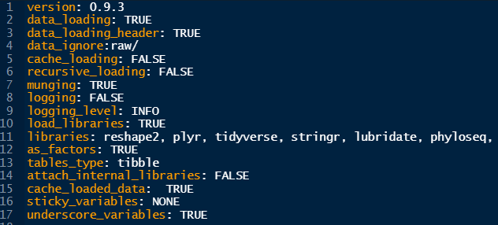

<div class="row video">
   <iframe id="video" width="560" height="315" src="https://www.youtube.com/embed/" frameborder="0" allow="autoplay; encrypted-media"
       allowfullscreen></iframe>
</div>

## Setting up a project

It is good practice to keep a set of related data, analyses, and text
self-contained in a single folder, called the **working directory**. All of the
scripts within this folder can then use *relative paths* to files that indicate
where inside the project a file is located (as opposed to absolute paths, which
point to where a file is on a specific computer). Working this way allows you to
move your project around on your computer and share it with others
without worrying about whether or not the underlying scripts will still work.

RStudio provides a helpful set of tools to do this through its "Projects"
interface, which not only creates a working directory for you, but also
remembers its location (allowing you to quickly navigate to it) and optionally
preserves custom settings and (re-)open files to assist resume work after
a break. Go through the steps for creating an "R Project" for this tutorial
below.

1.  Start RStudio.
2.  Under the `File` menu, click on `New Project`. Choose `New Directory`, then
    `New Project`.
3.  Enter a name for this new folder (or "directory"), and choose a convenient
    location for it. This will be your **working directory** for the rest of the
    day (e.g., `~/data-carpentry`).
4.  Click on `Create Project`.
5.  (Optional) Set Preferences to 'Never' save workspace in RStudio.

A workspace is your current working environment in R which includes any
user-defined object. By default, all of these objects will be saved, and
automatically loaded, when you reopen your project. Saving a workspace to
`.RData` can be cumbersome, especially if you are working with larger datasets,
and it can lead to hard to debug errors by having objects in memory you forgot
you had. Therefore, it is often a good idea to turn this off. To do so, go to
Tools --\> 'Global Options' and select the 'Never' option for
'Save workspace to .RData' on exit.'

### Using the ProjectTemplate package

ProjectTemplate is a system for automating the thoughtless parts of a data analysis project:

- Organizing the files in your project.
- Loading all the R packages you’ll use.
- Loading all of your data sets into memory.
- Munging and preprocessing your data into a form that’s suitable for analysis.

Each time you are working in your project you must load the ProjectTemplate package. 
When you are first creating your project use the function `create.project()`. When you
are working in a project that has already been created use the function `load.project()` 
to bring your project into R.
```
library("ProjectTemplate") #load the package
create.project() #only run this one time to create your project
load.project() #run this every time you open your project
```

The ProjectTemplate package will create a project template in your working directory. You can customize this template
by adding/removing folders as required. A minimal project template should include: 

| Folder | Contents |
| --- | --- |
| data/ | Input data files. It is a good idea to create a `raw/` subfolder to store all your raw data. |
| results/ | Output results files (e.g. statistical test results) |
| figures/ | Save figures to this folder | 
| config/ | holds the global.dcf file that specifies all the options for your project (see below) | 
| munge/ | holds scripts to pre-process your data |

**Project settings**
To control what happens when you load your project you can modify your project settings. 
Your project settings are saved and edited in the file `global.dcf` as shown below. 



| Setting | Options |
| --- | --- |
| data_loading | TRUE / FALSE : controls whether files in your `data\` folder are loaded automatically into RStudio |
| data_ignore | add the folder `raw\` to prevent raw data files from being loading into RStudio |
| cache_loading | TRUE / FALSE : change to FALSE to prevent previous outputs from being loaded |
| munging | TRUE / FALSE : do you have pre-processing scripts that you want to run every time you load your project? |
| load_libraries | TRUE / FALSE : set to TRUE so that all the packages you need are automatically loaded | 
| libraries | list the packages that you need |

### R Markdown

You can code in the console, but your code won't be saved and therefore won't be reproducible. You can also write in an R script saved
as `file.R`, but this is best for short scripts that do **one** thing specifically. When you are organizing data, making plots, and 
running stats it's easiest to organize your data in an R Markdown file saved as `file.Rmd`. You can also use R Markdown to automatically 
generate reports - you could even write your thesis using R Markdown!

The main benefit of R Markdown for analysis is that all your code is contained in "Code Chunks" and everything that is not in a code chunk
is ignored when you run your code. You can/should write notes between chunks explaining what each chunk is for. You can tell R to ignore 
something _inside_ a code chunk by putting a # to the left on the same line. 

Learn more about R Markdown [here](https://rmarkdown.rstudio.com/lesson-1.html).


